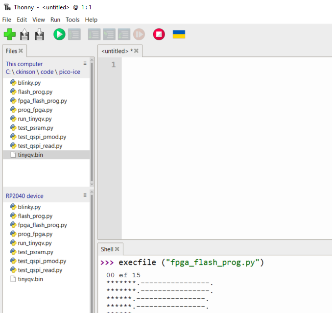

Dowload from v1.24.0(2024-10-25).uf2  from
https://micropython.org/download/RPI_PICO/

+Install micropython 

+Open Thorny and select the board (bottom right corner)
+Create "blinky.py" on your computer and upload with Thorny (View->Files) 

```
import time
from machine import Pin

print("starting")

OFF = 1
ON = 0

ledB = Pin(15, Pin.OUT)
ledR = Pin(13, Pin.OUT)
ledG = Pin(12, Pin.OUT)

ledB.value(OFF)
ledR.value(OFF)
ledG.value(OFF)

for i in range(10):
    ledR.value(OFF)
    time.sleep(1)
    ledR.value(ON)
    time.sleep(1)
```

In Thorny (Shell) type the following: 
execfile ("blink.py")

****************
After building the core for ICE40 you will have 'tinyQV.bin'. Upload it to pico-ice with thorny and type 
```
execfile ("fpga_flash_prog.py")
```


results
```
>>> execfile ("fpga_flash_prog.py")
00 ef 15 
*******.----------------.
*******.----------------.
******.----------------.
******.----------------.
******.----------------.
******.----------------.
******.----------------.
******.----------------.
******.----------------.
******.----------------.
******.----------------.
******.----------------.
******.----------------.
******.----------------.
*******.----------------.
******.----------------.
******.----------------.
******.----------------.
******.----------------.
******.----------------.
******.----------------.
******.----------------.
******.----------------.
******.----------------.
******.----------------.
******.-------.
Program done
Verify done
ff 00 00 ff 7e aa 99 7e 51 00 01 05 92 00 20 62 
``

then type. This will setup the pico to "feed" the FPGA with a CLK signal
```
>>> execfile ("run_tinyqv.py")
>>> 
```

build example application for tinyQV
https://github.com/MichaelBell/tinyQV-projects

upload them to pico
--stop fpga and clock feed
use "flash_prog.py" to upload tinyQV flash in the PMOD
--restart fgpa with "run_tinyqv.py"


